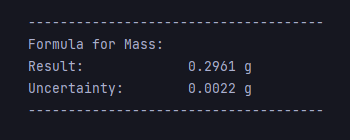

# PyFormulas

Python module implementing basic physics formula creation functionality - it allows to create physical quantity objects, which are then used to create formulas
for easier calculation. Each Physical quantity can define its measurements uncertainties, which are used for calculation of total uncertainty of the final result. 

This example shows how to use the FormulaCreator class to perform calculations. There are two physical quantities, which were measured with a certain error.
Using error propagation, total uncertainty of final result is displayed alongside with calculated numeric value of the formula, as seen below.

This module makes calculation of uncertainties much easier and faster and may be used for verification of calculations from other sources. It is highly dependent
on Python numerical modules such as SymPy and NumPy, which are used for derivative calculation and defining formulas and numerical evaluations. Those modules
are known for very efficient and precise results, so similar results may be expected.
